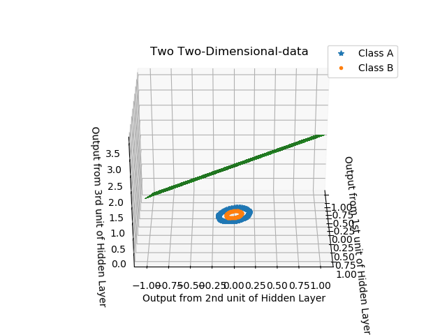
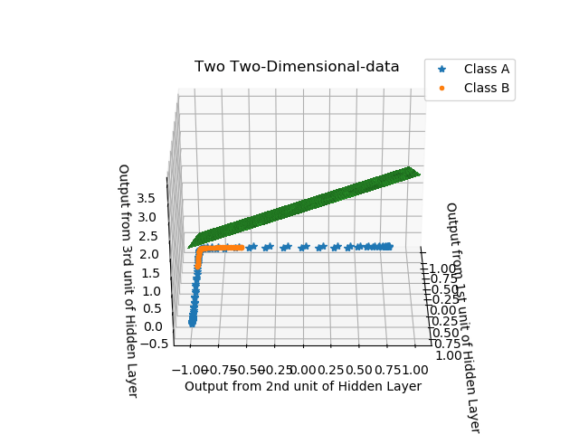
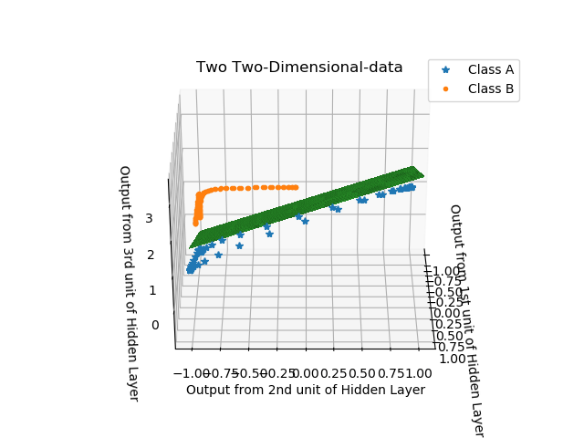

# 2-D data analysis with Neural-Network.
This is a Two Dimensional data which has 100 2-D data points from each class[Two Classes]. The plot of the data is as follows which gives a clear idea about the decision boundary required for classification. This data is generated using scikit learn datasets [make_circles].

 

  

# Network Details
If we use a neural network with 2 layers (input layer is not counted) i.e. Hidden layer and Output layer and where hidden layer has only 2 units then we will not be able to classify this data. This is because the data in 2-D space needs a non-linear boundary and with our configuration of neural network, where output layer has 1 unit and hidden layer has 2 unit, will not be able to create a non-linear boundary. 

This data in 2 dimensional space is not linearly separable so in this case we will need at least 3 units in the hidden layer. These 3 units in the hidden layer will project our 2-Dimensional input into 3-D space where the data will be linearly separable and after which our neural network will start classifying the data without any problem.

For the analysis we will just concentrate on the three output from the three hidden units, weights and bias vectors of the 2nd layer. We are just simply using a neural network show below in the image.

### Mathematical formula for this neural net
For one particular data sample *x*(*i*):
 
*z**[1] (i)* =  *W**[1]* *x**(i)* + *b**[1] (i)*
 
*a**[1] (i)* = *tanh*(*z**[1] (i)*)
 
*z**[2] (i)* = *W**[2]* *a**[1] (i)* + *b**[2] (i)*
 
*y**(i)* = *a**[2] (i)* = σ(*z**[2] (i)*)
 

  

We will use the above maths to calculate output from each layer. Here a1 is 3-Dimensional which is the output from hidden layer and a2 is 1-Dimensional which is the output from output layer. As this is a two class classification problem we will just we sigmoid in the output layer as activation function and in the hidden layer we will use Tanh as the activation function. We will use the regular gradient descent approach to find the optimized weights and bias vectors for each layer. At every iteration of the gradient descent we will store the output from the hidden layer i.e. 3 dimensional vector which is the output from 3 units of the hidden layer. We will also store the weights and bias vectors of the last layer at each gradient descent step. The hidden layer acts as input, specifically a 3-dimensional input, and weights and bias vector in the last layer acts the decision boundary plane.

#Analysis
The following GIF shows how the 2-Dimensional input data looks like after being projected into the 3-D space by the 3 hidden units in the hidden layer. The weight vector in the last layer connects 3 hidden unit to the 1 output unit so its dimension is 3x1 and bias is just a constant for this last layer. So the weight vector and bias vector forms a plane in 3D space and can we shown using the equation as W1.H1 + W2.H2 + W3.H3 + b2 = 0. In this equation W1, W2, W3 are the weights connecting hidden unit H1,H2,H3 respectively to the output unit and b is the bias vector. This decision plane equation can be directly related to the Logistic regression equation because if we just consider the last 2 layers then it problem becomes a logistic regression problem (just a analogy for understanding). So in the GIF the green colored plane is the initial decision boundary plane which is clearly not classifying the data correctly. 

  

After 2000 iterations of gradient descent (or weight update process) we see the following output shown in the GIF. As we can see the 2-D data has been stretched in 3-D dimensional space. Although still the decision plane is not classifying the data correctly.

  

After 5000 iterations of gradient descent we see the following output shown in the GIF. As we can see the 2-D data has been expanded a lot in 3-D space and now the data is clearly linearly separable. We can also see that the green decision boundary plane is now able to divide the two classes and is now giving us correct answer. 

  

Last we will see the whole process of the transformation of the 2-D data in 3-D space. We can clearly see in the GIF below how 2-D data non linearly separable data stretches in 3D space and how it becomes linearly separable in 3-D space. You can study the article referenced below which gives a more detailed explanation of what is happening. 

  

# References -
http://colah.github.io/posts/2014-03-NN-Manifolds-Topology/
